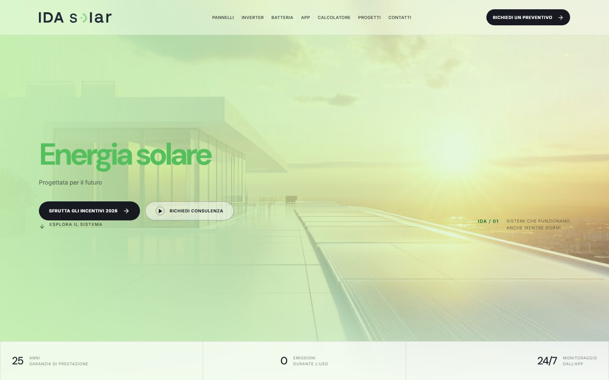
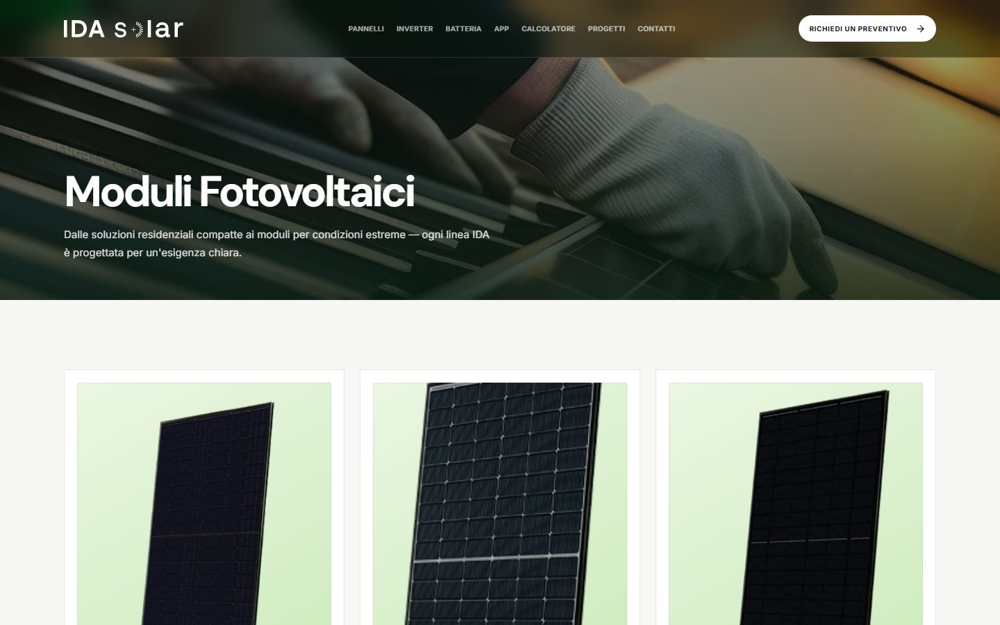
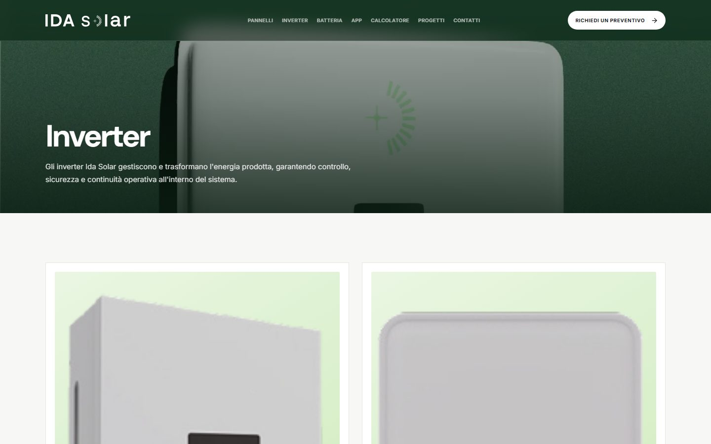
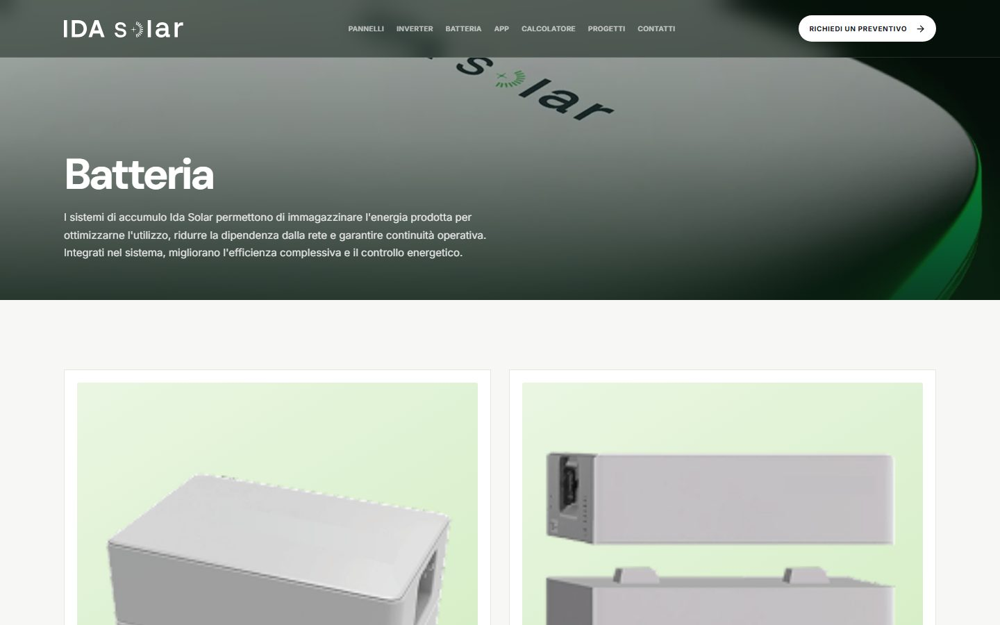
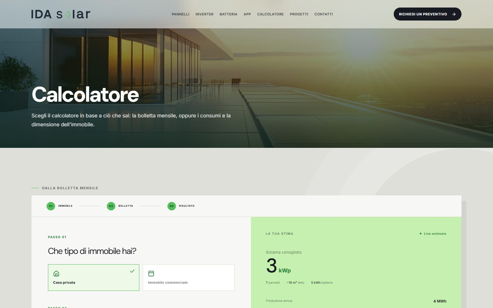
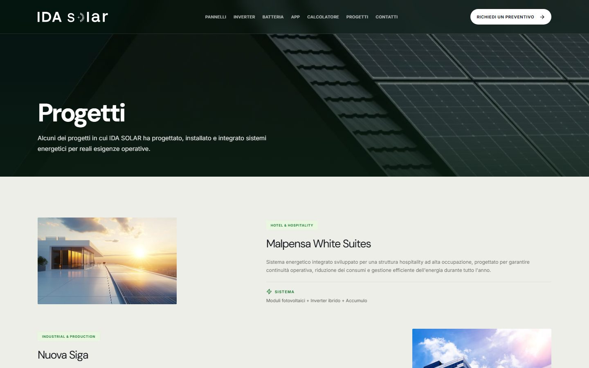
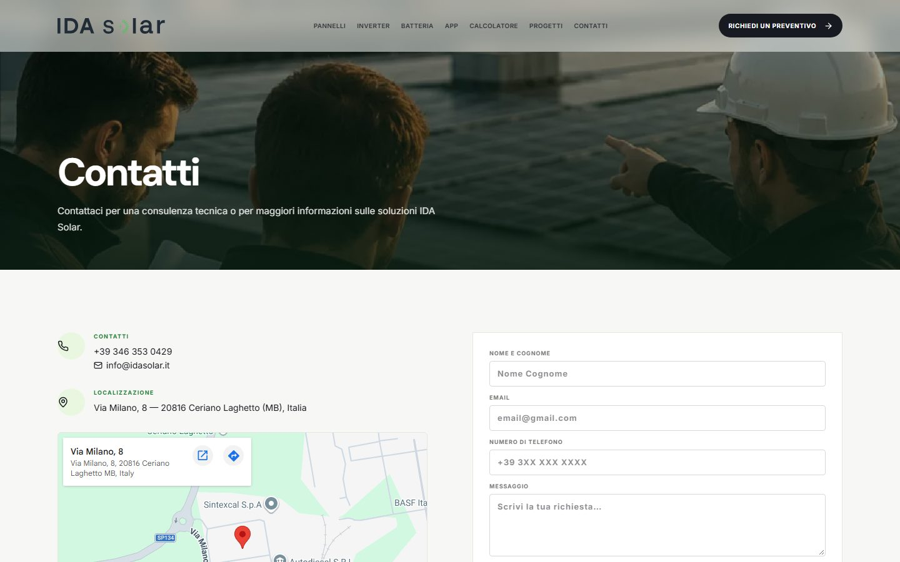
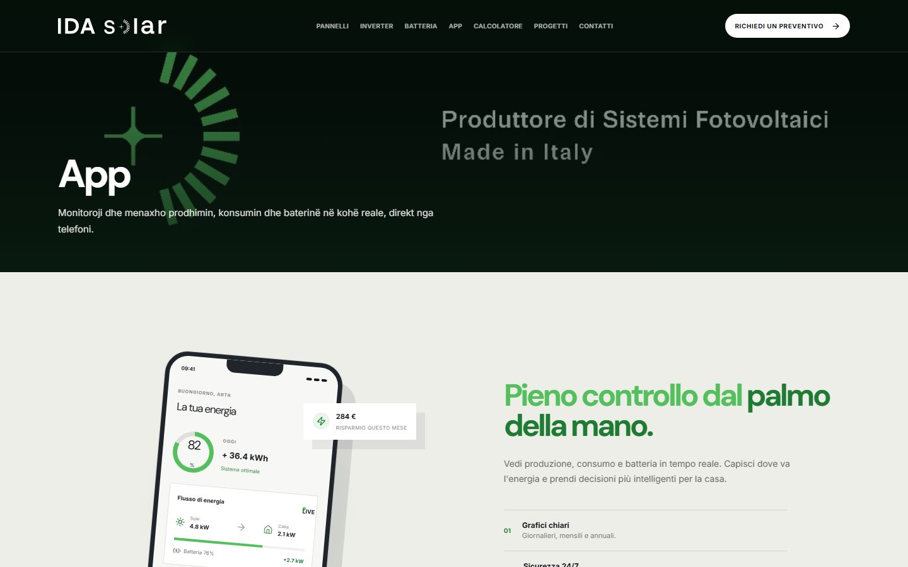
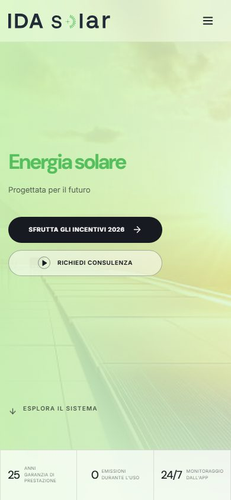

<div align="center">

# ☀️ IDA SOLAR

**Clean energy. Total independence.**

The official website for **IDA Solar** — photovoltaic modules, inverters and
energy storage systems for homes, businesses and infrastructure.

<br />

[](https://arditceno.github.io/IDASolar/)
[](https://github.com/ArditCeno/IDASolar/actions/workflows/deploy.yml)

[](https://react.dev/)
[](https://www.typescriptlang.org/)
[](https://vite.dev/)
[](https://tailwindcss.com/)
[](./LICENSE)

</div>



---

##  Overview

A fast, multilingual marketing website built with **React + Vite** and a
custom, brand-driven design system. It showcases IDA Solar's product lines,
real installation projects and an interactive sizing calculator, while keeping
a strong focus on performance, accessibility and a smooth mobile experience.

The site ships as a fully static bundle and is **automatically deployed to
GitHub Pages** on every push to `main`.

---

##  Features

-  **6 languages** — Italian (default), English, Spanish, French, German and
  Albanian, switchable on the fly with `localStorage` persistence.
-  **Interactive sizing calculator** — estimate a system from either the
  monthly bill or the household consumption & size.
-  **Product & project catalogs** — expandable cards, image galleries and
  scroll-reveal animations.
-  **Animated app mockup** — a responsive phone preview that scales cleanly
  from desktop down to mobile.
-  **Adaptive glass header** — automatically switches contrast based on the
  hero image luminance.
-  **Consultation request modal** — validated contact form with toast
  feedback.
-  **Instant contact CTAs** — WhatsApp, phone and Instagram.
-  **Static & fast** — prerendered build, no runtime backend required.

---

##  Tech Stack

| Layer | Technology |
| --- | --- |
| **Framework** | React 19 + TypeScript |
| **Build tool** | Vite 7 |
| **Routing** | [wouter](https://github.com/molefrog/wouter) (hash location for GitHub Pages) |
| **Styling** | Tailwind CSS v4 + custom CSS design tokens |
| **UI & icons** | Radix UI primitives · [lucide-react](https://lucide.dev/) |
| **Motion & charts** | Framer Motion · Recharts |
| **Notifications** | Sonner |
| **i18n** | Custom dictionary + DOM translator (no heavy dependency) |
| **Server (prod)** | Node.js + Express (serves the static build) |
| **Tooling** | pnpm · Prettier · tsc · Vitest |
| **Deploy** | GitHub Actions → GitHub Pages |

---

##  Project Structure

```
IDASolar/
├─ client/                     # React application
│  ├─ public/
│  │  ├─ images/               # Site imagery (products, projects, heroes)
│  │  └─ fonts/                # Self-hosted webfonts
│  └─ src/
│     ├─ components/           # Layout, shared UI, BatteryGrid, …
│     ├─ pages/                # One file per route
│     ├─ i18n/                 # Dictionary, language context, DOM translator
│     ├─ lib/                  # Helpers (base-path aware asset(), utils)
│     ├─ contexts/             # Theme context
│     ├─ hooks/                # Reusable hooks
│     ├─ App.tsx               # Routes
│     └─ index.css             # Design system & component styles
├─ server/                     # Express server (static serving in production)
├─ shared/                     # Constants shared between client & server
├─ docs/screenshots/           # README screenshots
└─ .github/workflows/deploy.yml# CI/CD → GitHub Pages
```

---

##  Pages & Routes

| Route | Page |
| --- | --- |
| `/` | Home — hero, products, projects, process, CTA |
| `/moduli-fotovoltaici` | Photovoltaic modules |
| `/inverter` | Inverters |
| `/sistemi-di-accumulo` | Energy storage systems |
| `/app` | Mobile app |
| `/calcolatore` | Sizing calculator |
| `/progetti` | Projects & case studies |
| `/contatti` | Contact & location |

> Routes use **hash navigation** (e.g. `/#/app`) so deep links work on GitHub
> Pages without server-side rewrites.

---

## 🌍 Internationalization

The UI text lives in a single Albanian-keyed dictionary
(`client/src/i18n/translations.ts`) and is applied at runtime by a lightweight
DOM translator, so every string — including placeholders and `aria-label`s —
follows the selected language.

| Code | Language | Default |
| --- | --- | :---: |
| `it` | 🇮🇹 Italian | ✅ |
| `en` | 🇬🇧 English | |
| `es` | 🇪🇸 Spanish | |
| `fr` | 🇫🇷 French | |
| `de` | 🇩🇪 German | |
| `sq` | 🇦🇱 Albanian | |

---

## 🚀 Getting Started

**Prerequisites:** Node.js ≥ 20 and pnpm ≥ 10.

```bash
# 1. Install dependencies
pnpm install

# 2. Start the dev server (http://localhost:3000)
pnpm dev
```

### Available scripts

| Command | Description |
| --- | --- |
| `pnpm dev` | Start the Vite dev server |
| `pnpm check` | Type-check the project (`tsc --noEmit`) |
| `pnpm build` | Production build → `dist/public` |
| `pnpm preview` | Preview the production build locally |
| `pnpm start` | Serve the build with Express |
| `pnpm format` | Format the codebase with Prettier |

---

##  Build & Deploy

The project is configured with `base: "/IDASolar/"` and deployed to **GitHub
Pages** via the workflow in `.github/workflows/deploy.yml`:

1. **Checkout** → **Setup pnpm & Node** → **Install** → **Type-check** → **Build**
2. Upload the `dist/public` artifact and publish it with `actions/deploy-pages`.

Any push to `main` triggers a fresh build and deployment — the live site stays
in sync automatically.

> **One-time setup:** in *Settings → Pages → Build and deployment*, set
> **Source** to **GitHub Actions**.

---

##  Screenshots

<table>
  <tr>
    <td width="50%"></td>
    <td width="50%"></td>
  </tr>
  <tr>
    <td width="50%"></td>
    <td width="50%"></td>
  </tr>
  <tr>
    <td width="50%"></td>
    <td width="50%"></td>
  </tr>
  <tr>
    <td width="50%"></td>
    <td width="50%"></td>
  </tr>
</table>

---

##  Contact

| | |
| --- | --- |
| 🌐 **Website** | [arditceno.github.io/IDASolar](https://arditceno.github.io/IDASolar/) |
| ✉️ **Email** | [info@idasolar.it](mailto:info@idasolar.it) [astraxsolutions@gmail.com](mailto:astraxsolutions@gmail.com)|
| ☎️ **Phone / WhatsApp** | [+39 346 353 0429](https://wa.me/393463530429) |
| 📍 **Address** | Via Milano, 8 — 20816 Ceriano Laghetto (MB), Italy |
| 📷 **AstraX Solutions** | [@astraxsolutions](https://www.instagram.com/astraxsolutions/) |

---

##  License

Released under the **MIT License** — see [LICENSE](./LICENSE) for details.

<div align="center">
  <sub>Built by <a href="https://www.instagram.com/astraxsolutions/">AstraX Solutions</a></sub>
</div>
