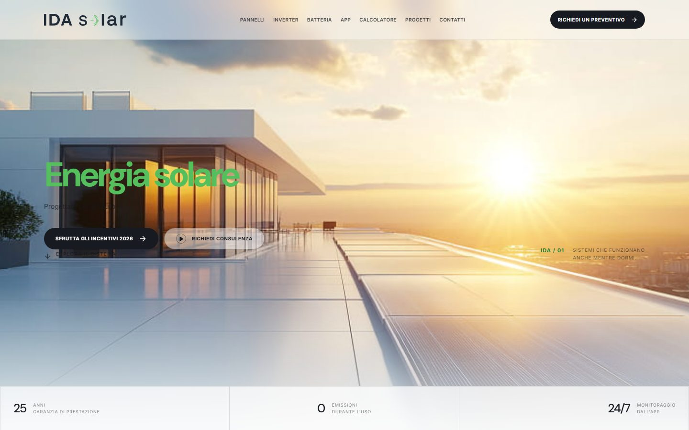
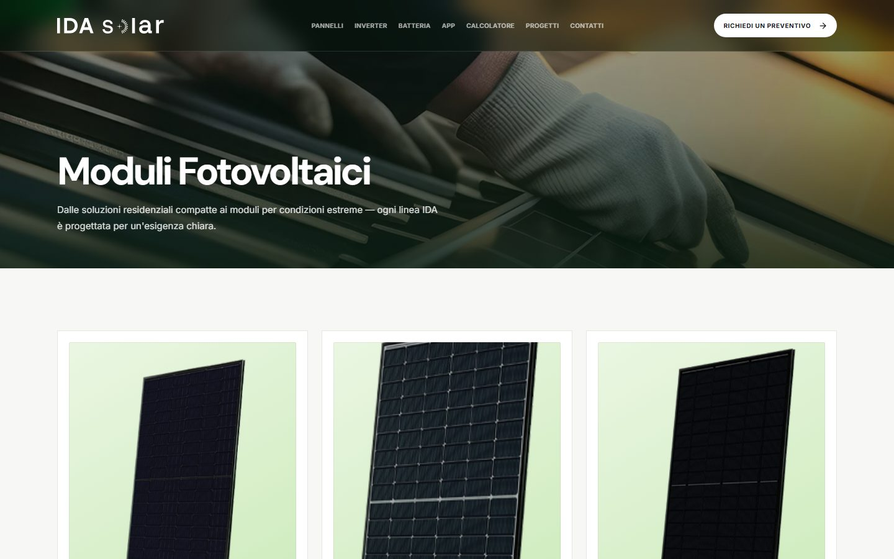
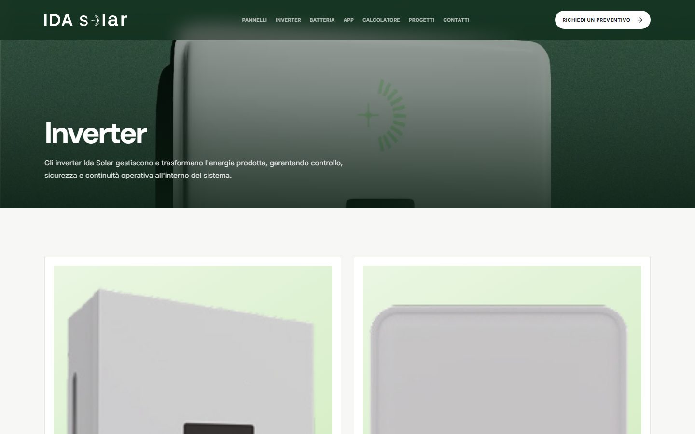
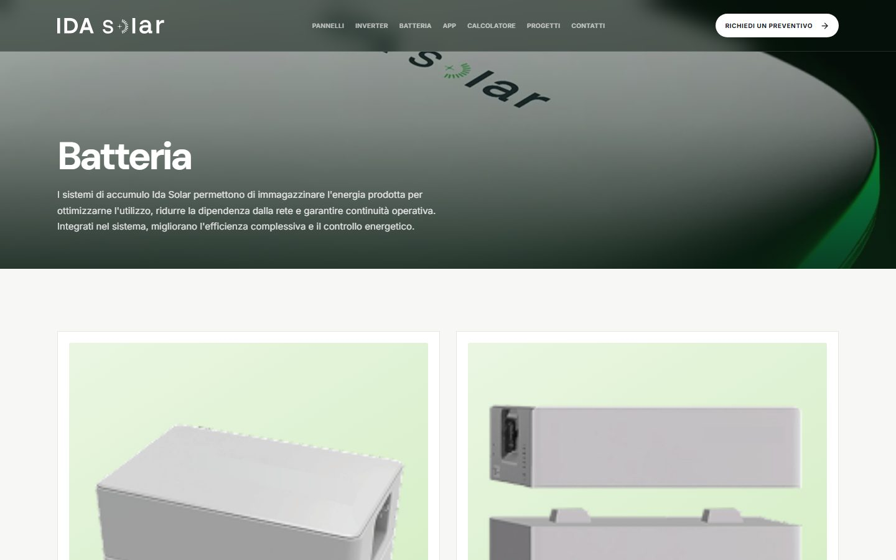
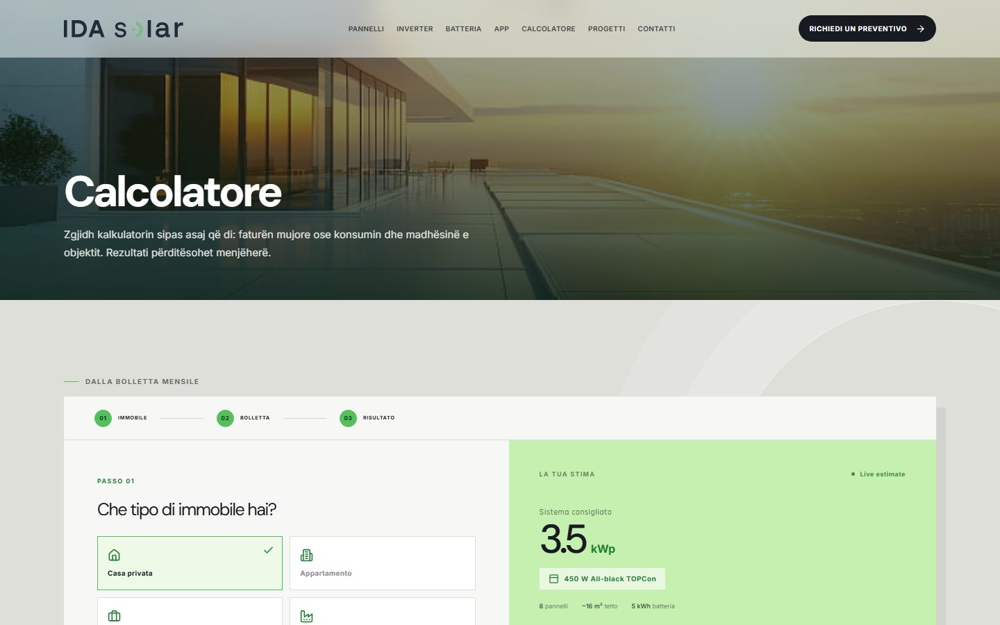
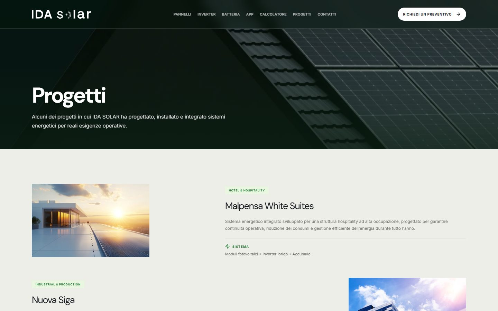
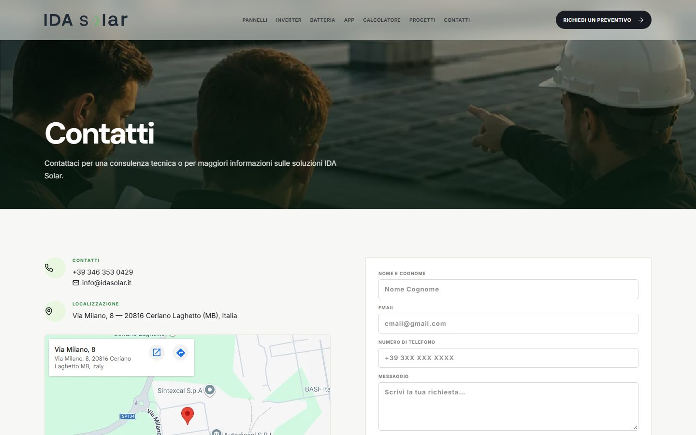
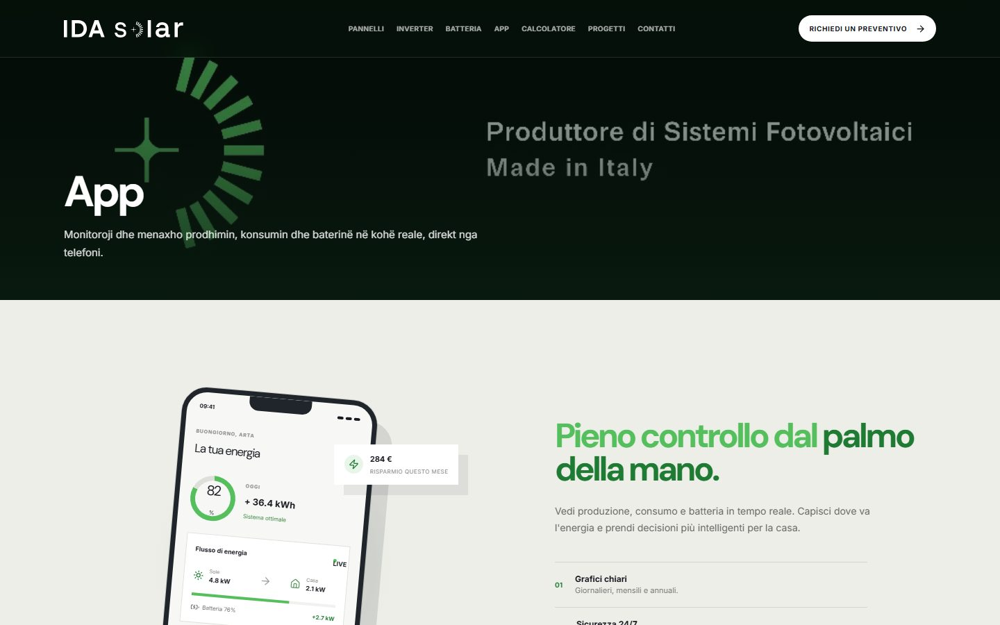
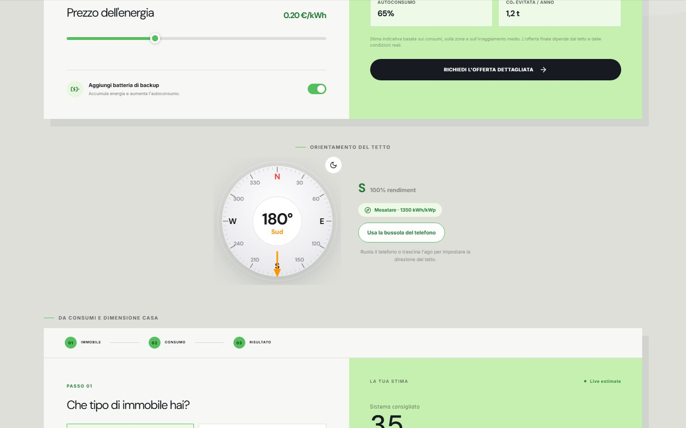

<div align="center">

# ☀️ IDA SOLAR

**Clean energy. Total independence.**

The official website for **IDA Solar** — photovoltaic modules, inverters and
energy storage systems for homes, businesses and infrastructure.

<br />

[](https://github.com/ArditCeno/IDASolar/actions/workflows/deploy.yml)

[](https://arditceno.github.io/IDASolar/)

[](https://react.dev/)
[](https://www.typescriptlang.org/)
[](https://vite.dev/)
[](https://tailwindcss.com/)
[](./LICENSE)

</div>



---

## Table of Contents

- [Overview](#overview)
- [Features](#features)
- [Tech Stack](#tech-stack)
- [Project Structure](#project-structure)
- [Pages & Routes](#pages--routes)
- [Solar Sizing Calculator](#solar-sizing-calculator)
- [Internationalization](#internationalization)
- [Getting Started](#getting-started)
- [Build & Deploy](#build--deploy)
- [Screenshots](#screenshots)
- [Contact](#contact)
- [License](#license)

---

## Overview

A fast, multilingual marketing website built with **React + Vite** and a
custom, brand-driven design system. It showcases IDA Solar's product lines,
real installation projects and an interactive sizing calculator, while keeping
a strong focus on performance, accessibility and a smooth mobile experience.

The site ships as a fully static bundle and is **automatically deployed to
GitHub Pages** on every push to `main`.

---

## Features

- **6 languages** — Italian (default), English, Spanish, French, German and
  Albanian, switchable on the fly with `localStorage` persistence.
- **Accurate sizing calculator** — estimate a system from the monthly bill
  or the household consumption & size, with savings, payback and CO₂.
- **Interactive orientation compass** — set the roof direction by dragging,
  with the keyboard, or by following the **phone's compass sensor**.
- **Automatic zone detection** — the solar yield is derived from the
  visitor's location (no manual region picker).
- **Product & project catalogs** — expandable cards, image galleries and
  scroll-reveal animations.
- **Animated app mockup** — a responsive phone preview that scales cleanly
  from desktop down to mobile.
- **Adaptive glass header** — automatically switches contrast based on the
  hero image luminance.
- **Consultation request modal** — validated contact form with toast
  feedback.
- **Instant contact CTAs** — WhatsApp, phone and Instagram.
- **Static & fast** — prerendered build, no runtime backend required.

---

## Tech Stack

| Layer | Technology |
| --- | --- |
| **Framework** | React 19 + TypeScript |
| **Build tool** | Vite 7 |
| **Routing** | [wouter](https://github.com/molefrog/wouter) (hash location for GitHub Pages) |
| **Styling** | Tailwind CSS v4 + custom CSS design tokens |
| **UI & icons** | Radix UI primitives · [lucide-react](https://lucide.dev/) |
| **Motion & charts** | Framer Motion · Recharts |
| **Notifications** | Sonner |
| **i18n** | Custom dictionary + DOM translator (no heavy dependency) |
| **Sizing engine** | Pure TypeScript model in `client/src/lib/solar.ts` |
| **Server (prod)** | Node.js + Express (serves the static build) |
| **Tooling** | pnpm · Prettier · tsc · Vitest |
| **Deploy** | GitHub Actions → GitHub Pages |

---

## Project Structure

```
IDASolar/
├─ client/                     # React application
│  ├─ public/
│  │  ├─ images/               # Site imagery (products, projects, heroes)
│  │  └─ fonts/                # Self-hosted webfonts
│  └─ src/
│     ├─ components/           # SiteLayout, OrientationCompass, CalcResult,
│     │                        # CalcExtras, BatteryGrid, …
│     ├─ pages/                # Home · Moduli · Inverter · Accumulo · App ·
│     │                        # Calcolatore · Progetti · Contatti
│     ├─ hooks/                # useGeoZone (GPS → zone), useMobile, …
│     ├─ i18n/                 # Dictionary, language context, DOM translator
│     ├─ lib/                  # solar.ts (sizing engine), asset(), utils
│     ├─ contexts/             # Theme context
│     ├─ App.tsx               # Routes
│     └─ index.css             # Design system & component styles
├─ server/                     # Express server (static serving in production)
├─ shared/                     # Constants shared between client & server
├─ docs/screenshots/           # README screenshots
└─ .github/workflows/deploy.yml # CI/CD → GitHub Pages
```

---

## Pages & Routes

| Route | Page |
| --- | --- |
| `/` | Home — hero, products, projects, process, CTA |
| `/moduli-fotovoltaici` | Photovoltaic modules |
| `/inverter` | Inverters |
| `/sistemi-di-accumulo` | Energy storage systems |
| `/app` | Mobile app |
| `/calcolatore` | Sizing calculator |
| `/progetti` | Projects & case studies |
| `/contatti` | Contact & location |

> Routes use **hash navigation** (e.g. `/#/app`) so deep links work on GitHub
> Pages without server-side rewrites.

---

## Solar Sizing Calculator

`/calcolatore` hosts a real-time sizing engine that turns the customer's own
numbers into a concrete system recommendation.

**Two ways to start**

| Mode | You provide | The engine computes |
| --- | --- | --- |
| **From the monthly bill** | Average monthly electricity bill (€) | Consumption → recommended system |
| **From consumption & size** | Monthly consumption (kWh) and floor area (m²) | Recommended size + typical-usage hint |

Each calculator carries its own **property type**, **energy-price slider** and
**backup-battery toggle**, so results update instantly.

**Interactive orientation compass** — set the roof direction on an iOS-style
compass: drag the needle, use the arrow keys, or tap **“Use the phone compass”**
to follow the device's real heading. A light/dark toggle and a live efficiency
read-out are included.

**Automatic zone detection** — the specific yield is derived from the
visitor's latitude (≈1,100 kWh/kWp in the North → ≈1,550 kWh/kWp in the South),
falling back to the Italian average when location is unavailable.

**What you get** — `kWp` · recommended panel · panel count · roof area ·
battery size · annual production · self-consumption · annual savings ·
20-year savings · **payback time** · **CO₂ avoided**.

**Assumptions** — editable in
[`client/src/lib/solar.ts`](./client/src/lib/solar.ts):

| Parameter | Value |
| --- | --- |
| Retail electricity price | 0.20 €/kWh |
| Surplus export price | 0.10 €/kWh |
| System cost | 1,300 €/kWp |
| Panel degradation | 0.5 %/year |
| Analysis horizon | 20 years |
| Self-consumption | 30–85 % (by property type & battery) |
| Specific yield | 1,050–1,600 kWh/kWp (by location & orientation) |

> All figures are indicative — the final offer depends on the real roof and
> installation conditions.

---

## Internationalization

The UI text lives in a single Albanian-keyed dictionary
(`client/src/i18n/translations.ts`) and is applied at runtime by a lightweight
DOM translator, so every string — including placeholders and `aria-label`s —
follows the selected language.

| Code | Language | Default |
| --- | --- | :---: |
| `it` | 🇮🇹 Italian | ✅ |
| `en` | 🇬🇧 English | |
| `es` | 🇪🇸 Spanish | |
| `fr` | 🇫🇷 French | |
| `de` | 🇩🇪 German | |
| `sq` | 🇦🇱 Albanian | |

---

## Getting Started

**Prerequisites:** Node.js ≥ 20 and pnpm ≥ 10.

```bash
# 1. Install dependencies
pnpm install

# 2. Start the dev server (http://localhost:3000/IDASolar/)
pnpm dev
```

### Available scripts

| Command | Description |
| --- | --- |
| `pnpm dev` | Start the Vite dev server |
| `pnpm check` | Type-check the project (`tsc --noEmit`) |
| `pnpm build` | Production build → `dist/public` |
| `pnpm preview` | Preview the production build locally |
| `pnpm start` | Serve the build with Express |
| `pnpm format` | Format the codebase with Prettier |

---

## Build & Deploy

The project is configured with `base: "/IDASolar/"` and deployed to **GitHub
Pages** via the workflow in `.github/workflows/deploy.yml`:

1. **Checkout** → **Setup pnpm & Node** → **Install** → **Type-check** → **Build**
2. Upload the `dist/public` artifact and publish it with `actions/deploy-pages`.

Any push to `main` triggers a fresh build and deployment — the live site stays
in sync automatically.

> **One-time setup:** in *Settings → Pages → Build and deployment*, set
> **Source** to **GitHub Actions**.

---

## Screenshots

<table>
  <tr>
    <td width="50%"></td>
    <td width="50%"></td>
  </tr>
  <tr>
    <td width="50%"></td>
    <td width="50%"></td>
  </tr>
  <tr>
    <td width="50%"></td>
    <td width="50%"></td>
  </tr>
  <tr>
    <td width="50%"></td>
    <td width="50%"></td>
  </tr>
</table>

---

## Contact

| | |
| --- | --- |
| 🌐 **Website** | [arditceno.github.io/IDASolar](https://arditceno.github.io/IDASolar/) |
| ✉️ **Email** | [info@idasolar.it](mailto:info@idasolar.it) · [astraxsolutions@gmail.com](mailto:astraxsolutions@gmail.com) |
| ☎️ **Phone / WhatsApp** | [+39 346 353 0429](https://wa.me/393463530429) |
| 📍 **Address** | Via Milano, 8 — 20816 Ceriano Laghetto (MB), Italy |
| 📷 **AstraX Solutions** | [@astraxsolutions](https://www.instagram.com/astraxsolutions/) |

---

## License

Released under the **MIT License** — see [LICENSE](./LICENSE) for details.

<div align="center">
  <sub>Built by <a href="https://www.linkedin.com/in/ardit-ceno-a674b5307/">Ardit Ceno</a> &amp; <a href="https://www.instagram.com/astraxsolutions/">AstraX Solutions</a></sub>
</div>
